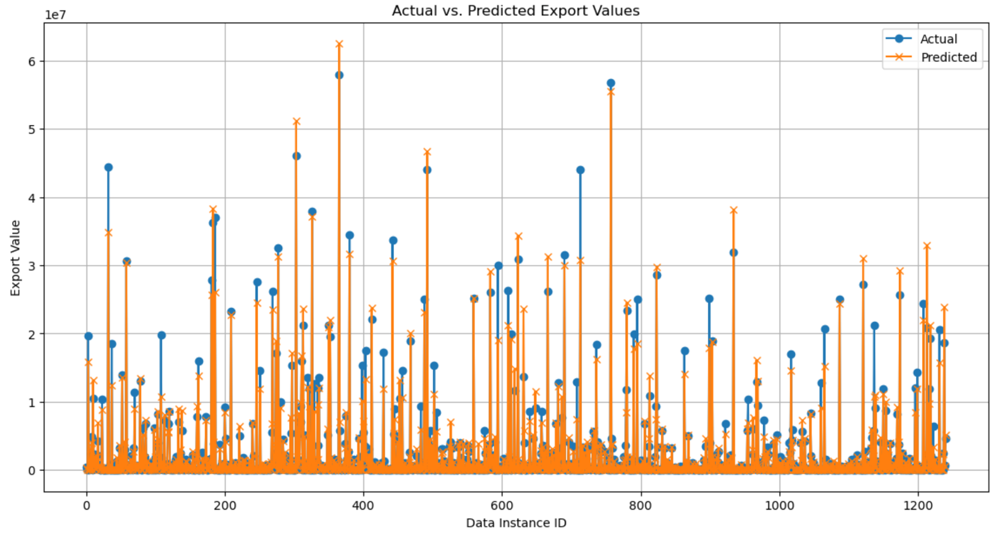

# Multilayer Perceptron Model for Forecasting Export Value of Crop Products

This repository contains the implementation of a Multilayer Perceptron (MLP) model designed to 
forecast the export value of crop products three years into the future. 
The project was completed as part of the Machine Learning coursework for my master’s degree at the University of Sussex.

## Project Overview
The Main goal of this project is to develop a neural network model capable of predicting the export value of
agricultural products based on historical data. The dataset comprises multiple indicators related to 
food and agriculture, collected across several categories. The forecasting task involves training 
a Multilayer Perceptron (MLP) model using this data to provide accurate export value predictions.

### Key Features

•	**Algorithm**: Multilayer Perceptron (MLP)

•	**Task**: Regression (Time-Series Forecasting)

•	**Dataset**: 13 CSV files covering various indicators related to agriculture and food production

•	**Objective**: Forecast export values for three years into the future

## Dataset

The dataset used in this project are 13 CSV files, each representing a 
distinct category of variables relevant to food and agriculture. 
The dataset is sourced from the FAOSTAT database and covers the following categories:

1.	Consumer Price Indicators
   
3.	Crops Production Indicators
   
5.	Emissions
   
7.	Employment
   
9.	Exchange Rate
    
11.	Fertilizers Use
    
13.	Food Balances
    
15.	Food Security Indicators
    
17.	Food Trade Indicators
    
19.	Foreign Direct Investment (FDI)
    
21.	Land Temperature Change
    
23.	Land Use
  
25.	Pesticides Use

## Data Structure

Each CSV file includes historical records of various indicators, 
with common columns for `Country` (which showing area in the files) and `Year`. But, 
the number of rows and columns are diffrent across files due to 
variations in the data coverage period and the number of sub-categories.

## Installation

To run this project from locally, make sure you have _Python_ installed. Then, install the required Python packages which 
is mentioned in `requirements.txt` file. 

### How to Use 

First, lunch the Jupyter file which is `code.ipynb`. Then, followin the the instructions in the notebook to:

. Load and preprocess the dataset.

. Train the MLP model. 

. Evaluate the model’s performance.

### Project Structure

.   datasets folder (Folder containing the 13 CSV files)

.   `code.ipynb` (Jupyter Notebook for Load and preprocess  data, train and evaluate model)

.    `Report.pdf` (Detailed report of the project analysis)

.   `requirements.txt` (Python dependencies)

.   `README.md` (Project overview which is this file)

## Methodology

1. **Data Preprocessing**:

. Exteract the important columns which are more related to the expport value of the crop products. 

. Merged the 13 CSV files using Country and Year as common columns.

. Handled missing values and normalized the features for better model performance.

. Split the data into training and testing sets based on the year.

2. **Model Architecture**:

The MLP model used for this project consists of:

•	Input Layer: Number of units equal to the number of features (n).

•	Hidden Layers:

   •	First Hidden Layer: 128 neurons with ReLU activation function
 
   •	Second Hidden Layer: 64 neurons with ReLU activation function
   
   •	Third Hidden Layer: 32 neurons with ReLU activation function
 
•	Output Layer: 1 neuron (for regression), with a linear activation function.

3. **Model Training and Evaluation**:

•	The model was trained on the preprocessed data.

•	Evaluation metrics used:

   1.	Mean Absolute Error (MAE)
      
   2.	Root Mean Squared Error (RMSE)

•	The model’s performance was compared against baseline metrics.

## Result 

The performance of the Multilayer Perceptron (MLP) model was evaluated using multiple metrics, with the following results:

•	Mean Absolute Error (MAE): 354,053

•	Mean Squared Error (MSE): ~1 billion

•	Root Mean Squared Error (RMSE): ~1 million

•	R² Score: 0.96

These metrics indicate that the model performs well in predicting the export values, as evidenced by the high R² score, which suggests that approximately 96.51% of the variance in the export values is explained by the model. Although the MAE appears large, it is relatively small when compared to the total export values, which are in the millions of dollars for each country. Thus, an error of around 354,053 is reasonable given the scale of the data.

### Experimentation

•	Additional Hidden Layer: An additional hidden layer with 256 neurons was tested. However, this increased the MAE to 451,437 and decreased the R² score to 0.94, indicating a negative impact on performance.

•	Optimizer and Learning Rate: The Adam optimizer was used with a learning rate of 0.01. In another experiment, increasing the learning rate to 0.1 improved the MAE, reducing it from 354,053 to 338,999.

•	Regularization Techniques:
   •	Dropout: Dropout layers with a rate of 0.2 were added after the first and second hidden layers to prevent overfitting by randomly ignoring 20% of the neurons during training.
   
   •	Validation Split: A validation split of 20% was used to monitor model performance on unseen data, aiding in early stopping to prevent overfitting.

### Actual vs Predicted Values

The graph below shows the comparison of actual export values against the predicted values. The close alignment of these values further supports the model’s predictive capability.

Here is the graph showing the actual vs predicted export values:

## Author

This project was developed by **Soheil Salemi** as part of the Machine Learning coursework for the Master’s course in Artificial Intelligence and Adaptive Systems at the University of Sussex.

